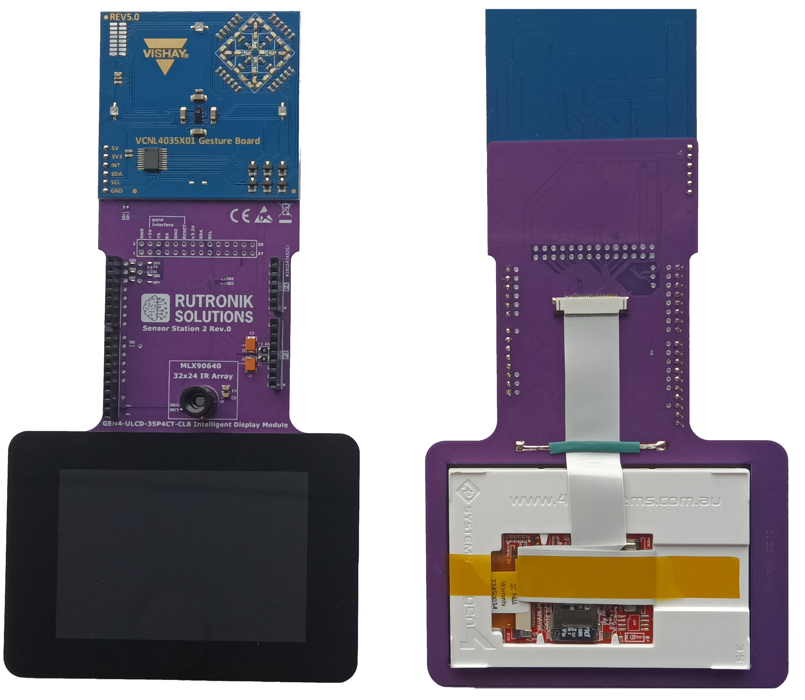

# Sensor Station 2 Arduino Adapter Project

This adapter was built to connect the Melexis MLX90640, the VISHAY VCNL4035X01 and 4D Systems GEN4-ULCD-35P4CT-CLB devices to the RDK2 and RDK3 development kits.

 

## Legal Disclaimer

The evaluation board including the software is for testing purposes only and, because it has limited functions and limited resilience, is not suitable for permanent use under real conditions. If the evaluation board is nevertheless used under real conditions, this is done at one’s responsibility; any liability of Rutronik is insofar excluded. 

